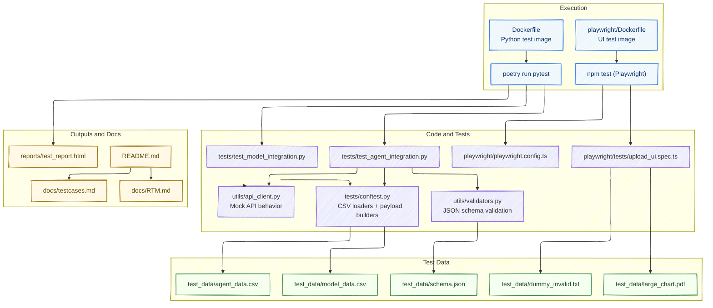

# Repository Overview Diagram (Mermaid)

```mermaid
---
config:
  layout: elk
  look: handDrawn
---
flowchart TB
 subgraph SRC["Code and Tests"]
        T1["tests/test_agent_integration.py"]
        T2["tests/test_model_integration.py"]
        TC["tests/conftest.py
    CSV loaders + payload builders"]
        U1["utils/api_client.py
    Mock API behavior"]
        U2["utils/validators.py
    JSON schema validation"]
        PW["playwright/tests/upload_ui.spec.ts"]
        PWC["playwright/playwright.config.ts"]
  end
 subgraph DATA["Test Data"]
        D1["test_data/agent_data.csv"]
        D2["test_data/model_data.csv"]
        D3["test_data/schema.json"]
        D4["test_data/dummy_invalid.txt"]
        D5["test_data/large_chart.pdf"]
  end
 subgraph RUN["Execution"]
        R1["poetry run pytest"]
        R2["npm test (Playwright)"]
        R3["Dockerfile
    Python test image"]
        R4["playwright/Dockerfile
    UI test image"]
  end
 subgraph OUT["Outputs and Docs"]
        O1["reports/test_report.html"]
        O2["docs/testcases.md"]
        O3["docs/RTM.md"]
        O4["README.md"]
  end
    R1 --> T1 & T2 & O1
    T1 --> TC & U1 & U2
    T2 --> TC & U1
    TC --> D1 & D2
    U2 --> D3
    R2 --> PWC & PW
    PW --> D4 & D5
    R3 --> R1
    R4 --> R2
    O4 --> O2 & O3

     D1:::data
     D2:::data
     D3:::data
     D4:::data
     D5:::data
     R1:::runtime
     R2:::runtime
     R3:::runtime
     R4:::runtime
     O1:::out
     O2:::out
     O3:::out
     O4:::out
    classDef group fill:#f6f8fa,stroke:#8c959f,color:#24292f,stroke-width:1px
    classDef runtime fill:#eef7ff,stroke:#1f6feb,color:#0b306a,stroke-width:1px
    classDef data fill:#f4fff0,stroke:#2a7f3f,color:#1b4728,stroke-width:1px
    classDef out fill:#fff8e6,stroke:#9a6700,color:#5c4500,stroke-width:1px
```

